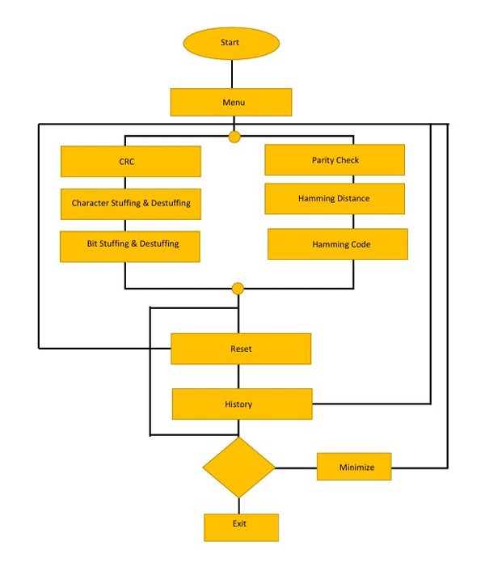
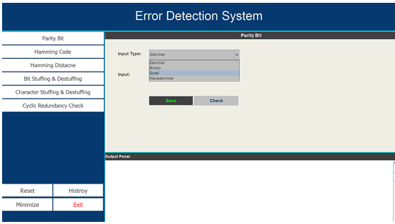

# data-guard-an-efficient-data-transmission-and-error-detection-system
The aim of this project is to develop and implement enhanced data transmission techniques with a focus on efficient encoding, error detection, and correction strategies. The project explores the utilization of bit stuffing, character stuffing, and error detection al gorithms to improve the reliability and integrity of data during transmission.

## Flow chart of the DataGuard System

## User Interface

